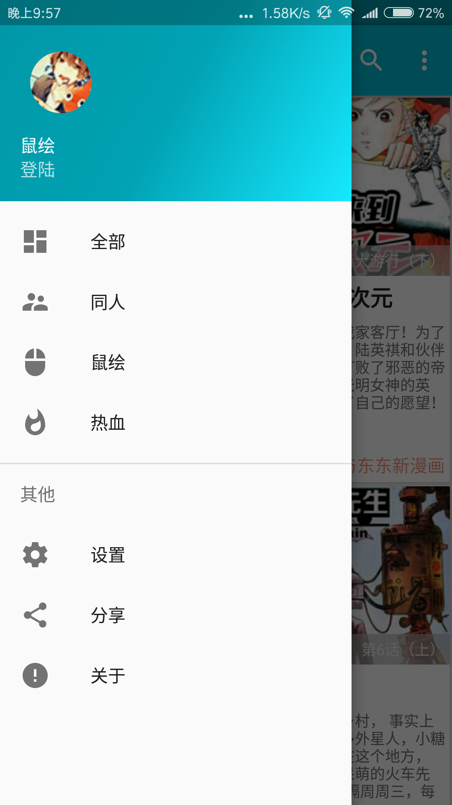
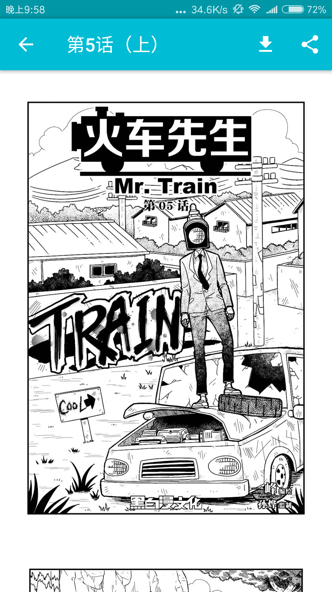

# Shuhui
鼠绘漫画的第三方客户端
 
[直接下载](https://fir.im/1d49) 
欢迎使用向我修功能提建议改bug 
相关文章：http://hugeterry.cn/dreams/324

 

 

#### 主要运用
- `Material Design`
- [Retrofit2](https://square.github.io/retrofit/) RESTful API库与响应式编程[Rxjava](https://github.com/ReactiveX/RxJava)结合
- [DBflow](https://github.com/Raizlabs/DBFlow)数据库
- [Glide](https://github.com/bumptech/glide) 图片加载
## 开源协议

[GPL v3](LICENSE)
